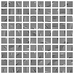

# UPDATE 16 Feb 2021:
* Pulled the code down and added a Decoder and ability to save both the sparse encoding dictionary, and the decoder model,
* Added tensorboard to visualize each stage (original, encoding, inference/reconstruction)

# To view the tensorboard:
* pull the repo
* open terminal window
* change directory to SparseCoding
* run: pip3 install tensorboard
* run: tensorboard --logdir runs/Feb16_13-11-06_danielsCoolProgramming/

# UPDATE 9 Sept 2020:
I tried pulling and running this to find it's incompatible with the latest pytorch, and with Windows. I will be updating it over the next week-- it won't run right now.
-Ben

# Usage
This demo requires [PyTorch](https://pytorch.org/).

To start an example, execute `python run_demo.py`, using ` --help` to see optional arguments. The default experiment is a dictionary learning demo with MNIST.

[//]: <`matlab_type_demo.py` is a sort of MATLAB-style script (an old version of the code that is less flexible). The results are visualized in the `results` subdirectory. You can play around with both model and optimization parameters in this file.>

## Purpose
The ultimate goal of this repository is to provide a sparse coding library that implements experimental platforms for (1) dictionary learning, (2) traditional/convex code inference (e.g. ISTA, SALSA), and (3) "unrolled" learnable encoders (e.g. LISTA,  [LSALSA](https://arxiv.org/abs/1802.06875)).

Dictionary learning is up-and-running, now. In particular I am building an encoder class that combines (2) and (3). Then I will generalize the class for morphological component analysis (MCA), a sparse-coding approach to source separation.

# Sparse Coding Background
It is often useful to represent a signal or image in terms of its basic building blocks. For example, a smiley-face can be efficiently described as "a circle, two dots, and a curve". At least, that is more efficient than "pixel 1: value 0.1. Pixel 2: value 1" and so on for thousands of pixels. This is a rudimentary example of "sparse representation"-- i.e., if we have a dictionary of shapes and curves, we can often describe an image as a weighted-sum of those dictionary elements. The fewer the number of dictionary atoms used, the more efficient/sparse the representation is. We refer to the list of weights to use as a "sparse code" when most of the weights are zero.

Sparse coding is the problem of jointly recovering the dictionary and the codes, given some data.
This repository provides some tools and classes for various sparse coding experiments.
As of now, the focus is on learning a linear dictionary (e.g. for vectors, including vectorized image patches) from data.
The training process yields a dictionary-- i.e. a matrix, whose rows are the dictionary elements-- which can be used along with a sparse code to represent a signal.

CIFAR, Fashion-MNIST, and ASIRRA- based atoms, with patch-sizes 10x10, 10x10, and 16x16, respectively. To see the atoms side-by-side with the corresponding data,  produced using my Lua-Torch version of this code.

This procedure is originally described in "Emergence of simple-cell receptive field properties by learning a sparse code for natural images", by Olshausen and Field [Nature, 381:607–609, 1996](https://www.nature.com/articles/381607a0).
It is famously used in "Learning Fast Approximations of Sparse Coding" (Gregor and Lecun)
 and recently in "LSALSA: efficient sparse coding in single and multiple dictionary settings" ([Cowen, Saridena, Choromanska](https://arxiv.org/abs/1802.06875)).

We train by minimizing
with respect to the matrix/dictionary/decoder 
:

where

 is a scalar parameter that balances sparsity with reconstruction error,

 is the dictionary,

is the p-th training data sample, and

is its corresponding _optimal sparse code_.

What do we mean by optimal sparse code? And why would we optimize an L1 term that does not include

(hence giving a zero subgradient)? The procedure is as follows.
1. Select a batch of image patches (or whatever training data): 
2. Compute optimal codes for each .
How? Fix .
With fixed , 
is convex with respect to !
So, we compute the argument-minimimum with respect to ,
to obtain an optimal code. We call  
the optimal code of ,
given the current dictionary. In this repo we compute optimal codes using an algorithm called FISTA.
Note: 
depends on 
,
but it does *NOT* depend on the algorithm used to encode ,
since it is a convex problem with a unique solution) 
3. Next, we un-fix , compute the gradient of 
with respect to 
and perform backpropagation using the batch. 
4. Re-normalize the columns of .
5. Go back to Step 1 and pull out a fresh batch, unless  has converged.

In summary, we do not couple the problems of sparse coding (producing codes) and training a decoder (a.k.a. dictionary). Rather, we iterate between them.

After successful optimization, the following should hold:

for .

In other words, the sparse vector 
multiplied with the (learned) dictionary 
provides an efficient approximation to the signal .

### TO-DO
* save dictionary objects
* put lua version on (maybe...)
* color version
* training script for encoders
* re-formulate "learned FISTA"
* look into SSNAL (see past team emails)
